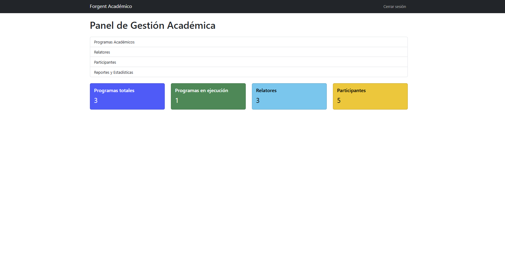
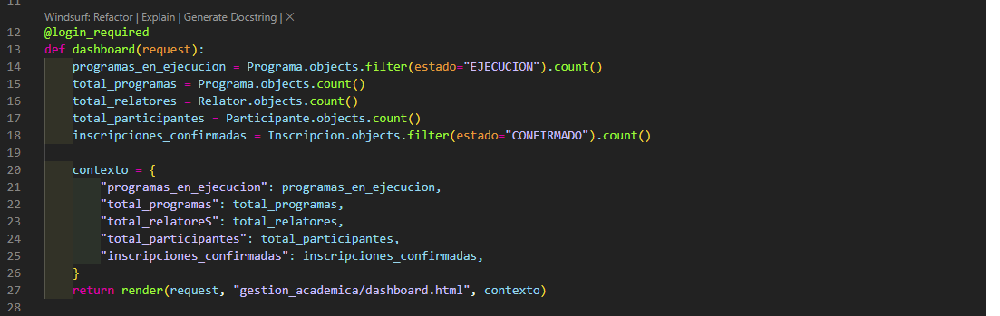
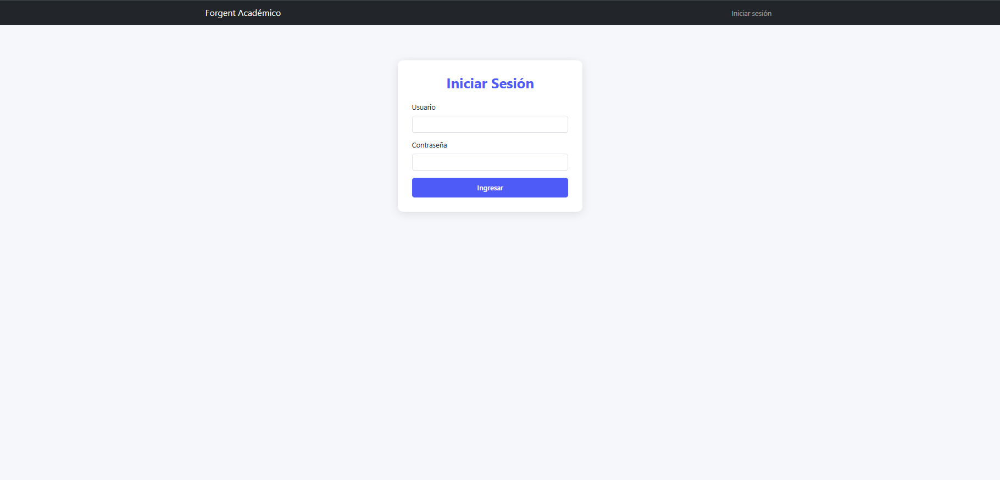
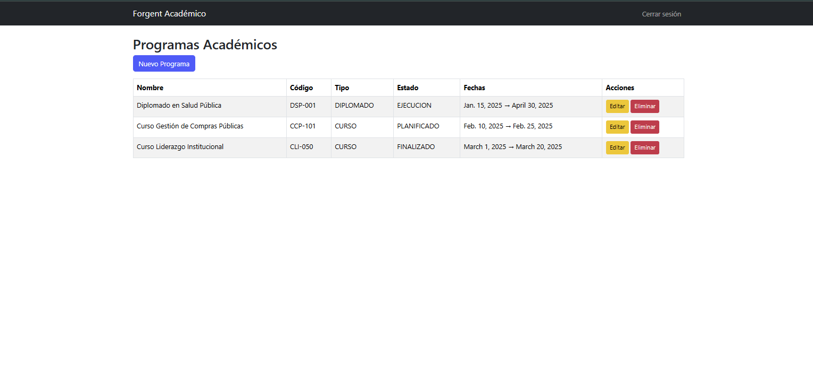
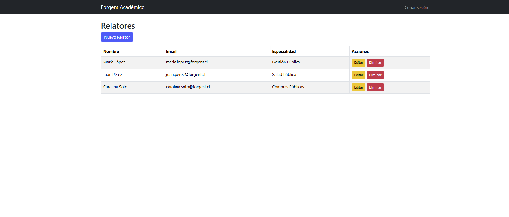
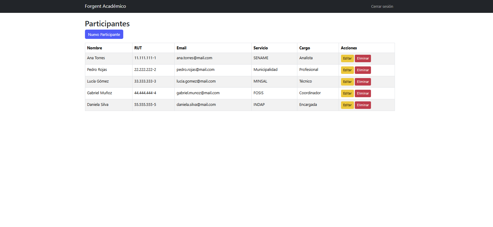
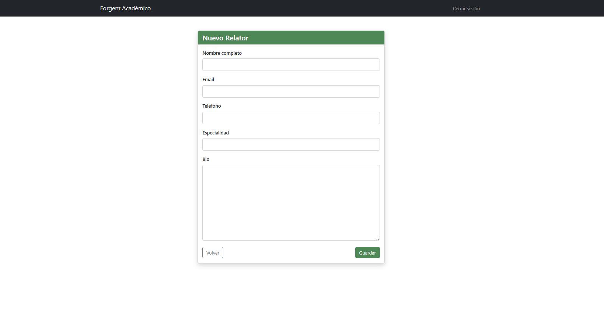
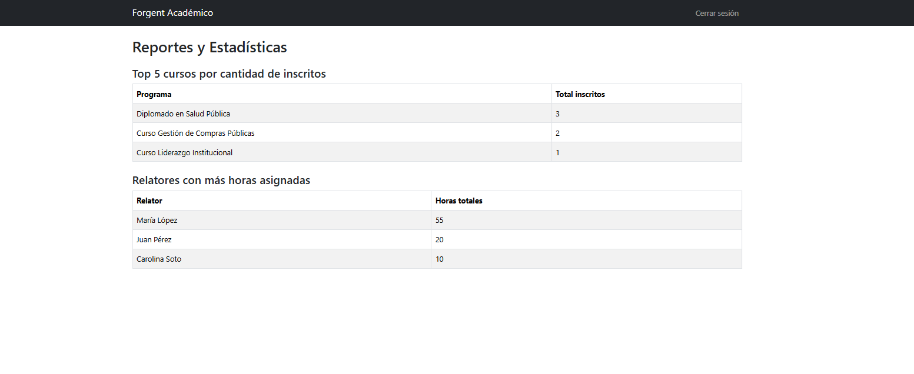

# Forgent Gestión Académica – Sistema de Administración Académica (Django + MySQL)


## Resumen del Proyecto

Forgent Gestión Académica es una aplicación web desarrollada con Django, MySQL y Bootstrap, diseñada para administrar:

- Programas académicos (cursos y diplomados)
- Relatores
- Participantes
- Inscripciones
- Reportes y estadísticas SQL

Este proyecto demuestra el dominio de:
- Desarrollo web full stack con Django
- ORM y SQL manual
- Modelamiento relacional
- Control de acceso
- Formularios y CRUD
- Bootstrap 5
- Buenas prácticas de arquitectura y código

Es presentado como producto final del Módulo 8 del Bootcamp Fullstack Python de Talento Digital.

## Problema

Los institutos de capacitación necesitan administrar:

- Cursos / diplomados
- Relatores asignados a cada programa
- Participantes inscritos
- Horas dictadas por relator
- Reportes y estadísticas

Esto suele hacerse en Excel, generando errores, duplicidad de información y dificultad para obtener indicadores.

## Solución Propuesta

Crear una aplicación web con:

✔ Autenticación y control de acceso
✔ CRUD completo (Programas, Relatores, Participantes, Inscripciones)
✔ Relación M2M con horas asignadas
✔ Reportes SQL optimizados
✔ Dashboard de indicadores
✔ Uso de ORM + SQL manual (según rúbrica)
✔ Frontend profesional con Bootstrap
✔ Base de datos MySQL para entorno real

## Arquitectura del Proyecto
```bash
Forgent Gestión Académica
│
├── Django 5.2.8 (Backend, vistas, CRUD, ORM)
├── MySQL (Base de datos relacional)
├── Bootstrap 5 (Frontend)
├── HTML + Templates Django
├── Django Auth (Login / Logout / Seguridad)
└── Python 3.12
```

## Modelos Django
Programa
 - nombre
 - código
 - tipo (curso / diplomado)
 - fechas
 - horas totales
 - estado

Relator
 - nombre
 - email
 - especialidad
 - bio

Participante
 - nombre
 - email
 - rut
 - servicio y cargo

Inscripción
 - FK Programa
 - FK Participante
 - estado
 - AsignaciónRelator (relación M2M con horas)
 - programa
 - relator
 - horas_asignadas

## Diagrama conceptual (abreviado)
```bash
Programa ---< Inscripcion >--- Participante
   |
   +---< AsignacionRelator >--- Relator
```

##  Instalación y Ejecución

1️⃣ Clonar el repositorio
```bash
git clone https://github.com/tu-repo.git
cd Proyecto_final
```

2️⃣ Crear entorno virtual
```bash
python -m venv myenv
myenv\Scripts\activate
```

3️⃣ Instalar dependencias
```bash
pip install -r requirements.txt
``` 

4️⃣ Conectar MySQL (settings.py)
```bash
DATABASES = {
    "default": {
        "ENGINE": "django.db.backends.mysql",
        "NAME": "forgent_academico",
        "USER": "root",
        "PASSWORD": "",
        "HOST": "localhost",
        "PORT": "3306",
    }
}
```

5️⃣ Migraciones
```bash
python manage.py migrate
```

6️⃣ Ejecutar aplicación
```bash
python manage.py runserver
```

## Datos de prueba (cargados por shell)


```bash
python manage.py shell
```

(Usuarios, programas, relatores, participantes, inscripciones…)

## Dashboard


Incluye:
- Total programas
- Inscripciones confirmadas
- Participantes registrados
- Relatores activos

## Consultas SQL (Rúbrica Talento Digital)
1️⃣ Programas con mayor número de inscritos
```bash
SELECT p.nombre, COUNT(i.id) AS total_inscritos
FROM gestion_academica_programa p
LEFT JOIN gestion_academica_inscripcion i
ON p.id = i.programa_id
GROUP BY p.id
ORDER BY total_inscritos DESC;
```

2️⃣ Relatores con más horas asignadas
```bash
SELECT r.nombre_completo, SUM(ar.horas_asignadas) AS horas_totales
FROM gestion_academica_relator r
JOIN gestion_academica_asignacionrelator ar
ON r.id = ar.relator_id
GROUP BY r.id
ORDER BY horas_totales DESC;
```

## Consultas ORM (Rúbrica)
ProgramasEnEjecucion = Programa.objects.filter(estado="EJECUCION")

InscripcionesConfirmadas = Inscripcion.objects.filter(estado="CONFIRMADO").count()

RelatoresActivos = Relator.objects.count()

ParticipantesTotal = Participante.objects.count()




## Autenticación y Control de Acceso


✔ LoginView
✔ LogoutView
✔ login_required en todas las vistas
✔ Redirección segura
✔ Solo usuarios autenticados pueden acceder al panel

## Galería de Capturas

📌 Dashboard

📌 Programas

📌 Relatores

📌 Participantes

📌 Nuevo Programa

📌 Estadísticas SQL


## Conclusiones

Este proyecto demuestra:
- Dominio de Django, modelos, ORM y vistas
- Diseño de base de datos robusta
- Relaciones complejas (M2M con horas)
- Consultas SQL + ORM
- Seguridad y autenticación
- Interfaz mejorada con Bootstrap
- Arquitectura limpia y profesional

## Licencia

MIT License — libre para uso académico y profesional.